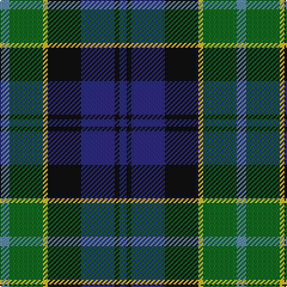

The parent of this is [Hogarth of Firhill Family Tartan Tartan Number: 198. Earliest known date: pre 2003 The Lyon Court Books record Bu1, Bk1, Bu6, Bk6, Y1, Gr6, Az2 as the thread count. These figures may be proportionally increased at the weavers discretion. See products available Copyright © Blair Urquhart, Comrie, 2015](/tartans/b/8/g28/y4/k28/db28/k4/db/6/)

This was sourced from house-of-tartan.  It is a [7 stripes tartan](/stripes/stripes7/).

Original link http://www.house-of-tartan.scotland.net/house/TartanViewjs.asp?colr=Def&tnam=198

## Thread count
B/8 G28 Y4 K28 DB28 K4 DB/6

## Palette
Each colour and its ΔE from the base-6 reference it is a variant of.

| Colour | Shade | Base | ΔE (OKLab) |
|---|---|---|---|
| B |  `#5C8CA8` | B  | 0.23 |
| DB |  `#2C2C80` | B  | 0.05 |
| G |  `#006818` | G  | 0.02 |
| K |  `#101010` | K  | 0.17 |
| Y |  `#E8C000` | Y  | 0.00 |

# Sample pattern

ID: /variants/b/8/g28/y4/k28/db28/k4/db/6-b5c8ca8-db2c2c80-g006818-k101010-ye8c000/
