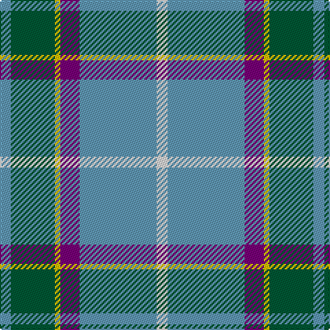

The parent of this is [Laxey Manx Blue (District)](/tartans/b/8/g32/y4/p14/b56/ln/8/)

This was sourced from tartans-authority.  It is a [6 stripes tartan](/stripes/stripes6/).

Original link http://www.tartansauthority.com/tartan-ferret/display/202/

## Thread count
B/8 G32 Y4 P14 B56 LN/8

## Palette
Each colour and its ΔE from the base-6 reference it is a variant of.

| Colour | Shade | Base | ΔE (OKLab) |
|---|---|---|---|
| B |  `#6098B4` | B  | 0.27 |
| G |  `#005834` | G  | 0.07 |
| LN |  `#E0E0E0` | W  | 0.06 |
| P |  `#780078` | B  | 0.16 |
| Y |  `#E8C000` | Y  | 0.00 |

# Sample pattern

ID: /variants/b/8/g32/y4/p14/b56/ln/8-b6098b4-g005834-lne0e0e0-p780078-ye8c000/
