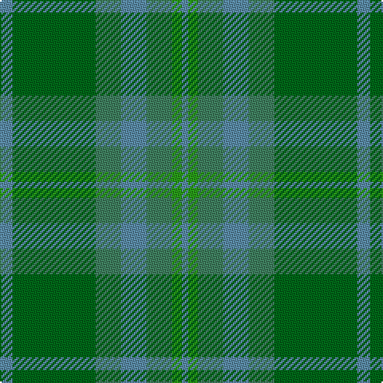

The parent of this is [Valley of the Green](/tartans/b/8/g52/gb16/b16/gb16/ga6/b/4/)

This was sourced from register-of-tartans.  It is a [7 stripes tartan](/stripes/stripes7/).

Original link https://www.tartanregister.gov.uk/tartanDetails.aspx?ref=4438

## Thread count
B/8 G52 Gb16 B16 Gb16 Ga6 B/4

## Palette
Each colour and its ΔE from the base-6 reference it is a variant of.

| Colour | Shade | Base | ΔE (OKLab) |
|---|---|---|---|
| B |  `#5C8CA8` | B  | 0.23 |
| DG |  `#003820` | G  | 0.16 |
| G |  `#006818` | G  | 0.02 |
| Ga |  `#289C18` | G  | 0.18 |
| Gb |  `#408060` | G  | 0.13 |

# Sample pattern

ID: /variants/b/8/g52/gb16/b16/gb16/ga6/b/4-b5c8ca8-dg003820-g006818-ga289c18-gb408060/
