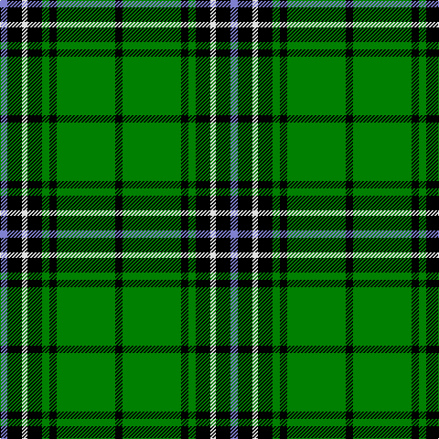

The parent of this is [Hartmann](/tartans/b/8/k16/ln6/k16/g8/k8/g64/k/8/)

This was sourced from weddslist.  It is a [8 stripes tartan](/stripes/stripes8/).

Original link http://www.weddslist.com/cgi-bin/tartans/pg.pl?source=sts

## Thread count
B/8 K16 LN6 K16 G8 K8 G64 K/8

## Palette
Each colour and its ΔE from the base-6 reference it is a variant of.

| Colour | Shade | Base | ΔE (OKLab) |
|---|---|---|---|
| B |  `#8080D0` | B  | 0.24 |
| G |  `#008000` | G  | 0.09 |
| K |  `#000000` | K  | 0.00 |
| LN |  `#E0E0E0` | W  | 0.06 |

# Sample pattern

ID: /variants/b/8/k16/ln6/k16/g8/k8/g64/k/8-b8080d0-g008000-k000000-lne0e0e0/
