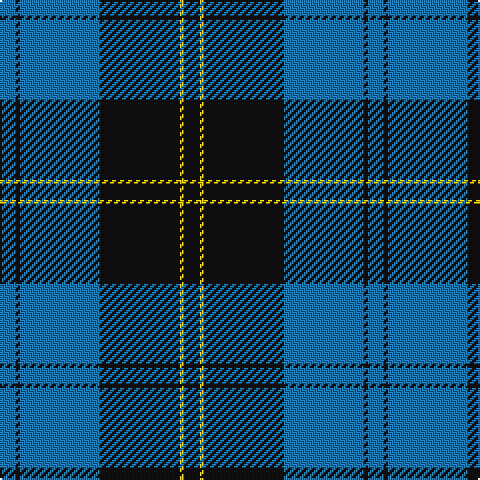

The parent of this is [Oakleigh (Corporate)](/tartans/b/8/k2/b40/k40/y2/k/8/)

This was sourced from tartans-authority.  It is a [6 stripes tartan](/stripes/stripes6/).

Original link http://www.tartansauthority.com/tartan-ferret/display/6017/

## Thread count
B/8 K2 B40 K40 Y2 K/8

## Palette
Each colour and its ΔE from the base-6 reference it is a variant of.

| Colour | Shade | Base | ΔE (OKLab) |
|---|---|---|---|
| B |  `#1474B4` | B  | 0.15 |
| K |  `#101010` | K  | 0.17 |
| Y |  `#E8C000` | Y  | 0.00 |

# Sample pattern

ID: /variants/b/8/k2/b40/k40/y2/k/8-b1474b4-k101010-ye8c000/
