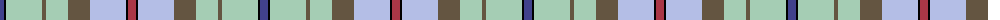

The parent of this is [Morgan in Maryland (USA)](/tartans/b/8/k2/na36/n4/na22/n22/lp36/k2/dr/8/)

This was sourced from register-of-tartans.  It is a [9 stripes tartan](/stripes/stripes9/).

Original link https://www.tartanregister.gov.uk/tartanDetails.aspx?ref=10088

## Thread count
B/8 K2 Na36 N4 Na22 N22 LP36 K2 DR/8

## Palette
Each colour and its ΔE from the base-6 reference it is a variant of.

| Colour | Shade | Base | ΔE (OKLab) |
|---|---|---|---|
| B |  `#41418C` | B  | 0.03 |
| DR |  `#AA3746` | R  | 0.08 |
| K |  `#000000` | K  | 0.00 |
| LP |  `#B4BEE6` | W  | 0.17 |
| N |  `#645541` | G  | 0.14 |
| Na |  `#A5CDB4` | Y  | 0.15 |

ID: /variants/b/8/k2/na36/n4/na22/n22/lp36/k2/dr/8-b41418c-draa3746-k000000-lpb4bee6-n645541-naa5cdb4/
