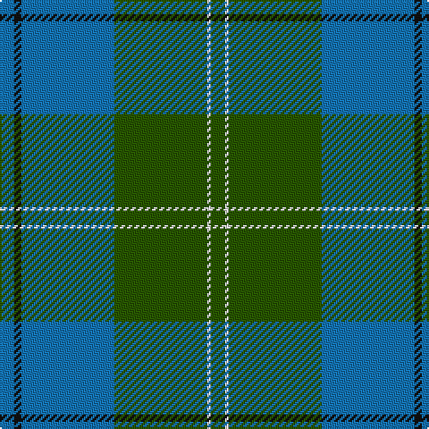

The parent of this is [Melville (Two black lines)](/tartans/b/8/k4/b52/g52/w2/g/8/)

This was sourced from register-of-tartans.  It is a [6 stripes tartan](/stripes/stripes6/).

Original link https://www.tartanregister.gov.uk/tartanDetails.aspx?ref=2915

## Thread count
B/8 K4 B52 G52 W2 G/8

## Palette
Each colour and its ΔE from the base-6 reference it is a variant of.

| Colour | Shade | Base | ΔE (OKLab) |
|---|---|---|---|
| B |  `#1474B4` | B  | 0.15 |
| G |  `#285800` | G  | 0.04 |
| K |  `#101010` | K  | 0.17 |
| W |  `#FCFCFC` | W  | 0.03 |

# Sample pattern

ID: /variants/b/8/k4/b52/g52/w2/g/8-b1474b4-g285800-k101010-wfcfcfc/
