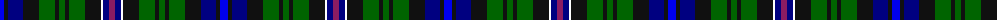

The parent of this is [Free (Wishaw)](/tartans/b/8/k4/db15/k16/g16/k4/g6/k4/g16/k16/w2/db6/p/6/)

This was sourced from register-of-tartans.  It is a [13 stripes tartan](/stripes/stripes13/).

Original link https://www.tartanregister.gov.uk/tartanDetails.aspx?ref=10156

## Thread count
B/8 K4 DB15 K16 G16 K4 G6 K4 G16 K16 W2 DB6 P/6

## Palette
Each colour and its ΔE from the base-6 reference it is a variant of.

| Colour | Shade | Base | ΔE (OKLab) |
|---|---|---|---|
| B |  `#0000EE` | B  | 0.18 |
| DB |  `#000080` | B  | 0.14 |
| G |  `#006400` | G  | 0.00 |
| K |  `#101010` | K  | 0.17 |
| P |  `#8B1C62` | R  | 0.17 |
| W |  `#FFFFFF` | W  | 0.03 |

ID: /variants/b/8/k4/db15/k16/g16/k4/g6/k4/g16/k16/w2/db6/p/6-b0000ee-db000080-g006400-k101010-p8b1c62-wffffff/
