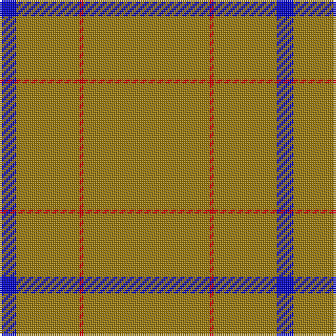

The parent of this is [Kincardine Tweed](/tartans/b/8/lg30/r2/lg/60/)

This was sourced from weddslist.  It is a [4 stripes tartan](/stripes/stripes4/).

Original link http://www.weddslist.com/cgi-bin/tartans/pg.pl?source=rb

## Thread count
B/8 LG30 R2 LG/60

## Palette
Each colour and its ΔE from the base-6 reference it is a variant of.

| Colour | Shade | Base | ΔE (OKLab) |
|---|---|---|---|
| B |  `#0000C8` | B  | 0.15 |
| G |  `#00C800` | Y  | 0.21 |
| LG |  `#9B7A0B` | R  | 0.20 |
| R |  `#C80000` | R  | 0.00 |
| T |  `#8B4513` | R  | 0.13 |

# Sample pattern

ID: /variants/b/8/lg30/r2/lg/60-b0000c8-g00c800-lg9b7a0b-rc80000-t8b4513/
