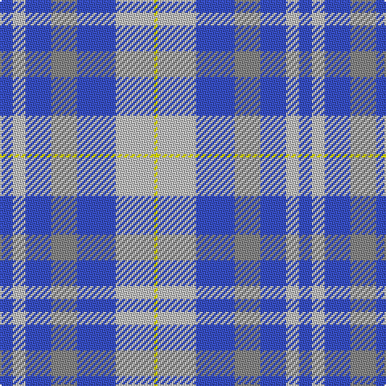

The parent of this is [von Prondzynski (2016)](/tartans/b/8/na8/b16/n16/b24/na24/y/2/)

This was sourced from register-of-tartans.  It is a [7 stripes tartan](/stripes/stripes7/).

Original link https://www.tartanregister.gov.uk/tartanDetails.aspx?ref=11635

## Thread count
B/8 Na8 B16 N16 B24 Na24 Y/2

## Palette
Each colour and its ΔE from the base-6 reference it is a variant of.

| Colour | Shade | Base | ΔE (OKLab) |
|---|---|---|---|
| B |  `#3850C8` | B  | 0.12 |
| N |  `#888888` | R  | 0.24 |
| Na |  `#C0C0C0` | W  | 0.16 |
| Y |  `#FFFF00` | Y  | 0.16 |

# Sample pattern

ID: /variants/b/8/na8/b16/n16/b24/na24/y/2-b3850c8-n888888-nac0c0c0-yffff00/
