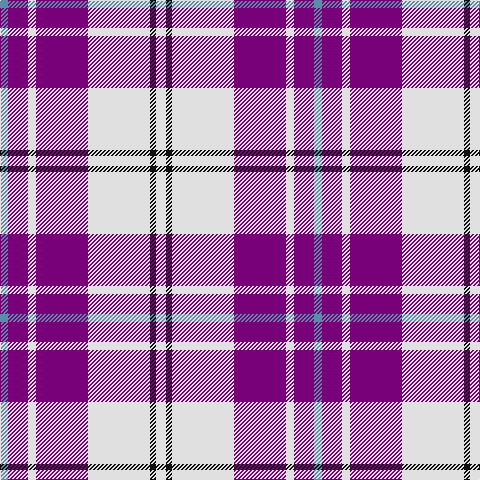

The parent of this is [MacPherson Dress (purple) Clan Tartan Tartan Number: 94. Earliest known date: c 1980 There are a great number of variations of the Dress MacPherson, many of them modern trade designs which are popular with country dancers. Hugh Macpherson of Edinburgh, kiltmaker and tartan designer some decades ago, supplied samples of these to the Scottish Tartan Society around 1980. See products available Copyright © Blair Urquhart, Comrie, 2015](/tartans/b/8/p20/ln8/p52/ln62/k6/ln/10/)

This was sourced from house-of-tartan.  It is a [7 stripes tartan](/stripes/stripes7/).

Original link http://www.house-of-tartan.scotland.net/house/TartanViewjs.asp?colr=Def&tnam=94

## Thread count
B/8 P20 LN8 P52 LN62 K6 LN/10

## Palette
Each colour and its ΔE from the base-6 reference it is a variant of.

| Colour | Shade | Base | ΔE (OKLab) |
|---|---|---|---|
| B |  `#5C8CA8` | B  | 0.23 |
| K |  `#101010` | K  | 0.17 |
| LN |  `#E0E0E0` | W  | 0.06 |
| P |  `#780078` | B  | 0.16 |

# Sample pattern

ID: /variants/b/8/p20/ln8/p52/ln62/k6/ln/10-b5c8ca8-k101010-lne0e0e0-p780078/
