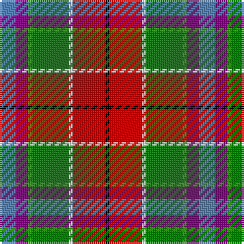

The parent of this is [Wilson's, No 121](/tartans/b/8/p6/g2/ga18/ln2/r16/k/2/)

This was sourced from weddslist.  It is a [7 stripes tartan](/stripes/stripes7/).

Original link http://www.weddslist.com/cgi-bin/tartans/pg.pl?source=sts

## Thread count
B/8 P6 G2 Ga18 LN2 R16 K/2

## Palette
Each colour and its ΔE from the base-6 reference it is a variant of.

| Colour | Shade | Base | ΔE (OKLab) |
|---|---|---|---|
| B |  `#5480B0` | B  | 0.20 |
| G |  `#30A010` | G  | 0.19 |
| Ga |  `#008000` | G  | 0.09 |
| K |  `#000000` | K  | 0.00 |
| LN |  `#E0E0E0` | W  | 0.06 |
| P |  `#800080` | B  | 0.17 |
| R |  `#C00000` | R  | 0.02 |

# Sample pattern

ID: /variants/b/8/p6/g2/ga18/ln2/r16/k/2-b5480b0-g30a010-ga008000-k000000-lne0e0e0-p800080-rc00000/
