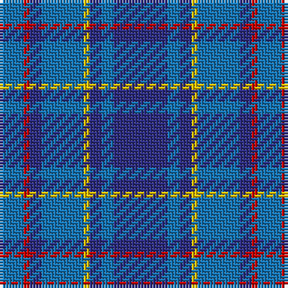

The parent of this is [Mercer, Charles (Name)](/tartans/b/8/r2/db4/b14/y2/db4/b4/db/18/)

This was sourced from tartans-authority.  It is a [8 stripes tartan](/stripes/stripes8/).

Original link http://www.tartansauthority.com/tartan-ferret/display/5880/

## Thread count
B/8 R2 DB4 B14 Y2 DB4 B4 DB/18

## Palette
Each colour and its ΔE from the base-6 reference it is a variant of.

| Colour | Shade | Base | ΔE (OKLab) |
|---|---|---|---|
| B |  `#1474B4` | B  | 0.15 |
| DB |  `#2C2C80` | B  | 0.05 |
| R |  `#C80000` | R  | 0.00 |
| Y |  `#E8C000` | Y  | 0.00 |

# Sample pattern

ID: /variants/b/8/r2/db4/b14/y2/db4/b4/db/18-b1474b4-db2c2c80-rc80000-ye8c000/
