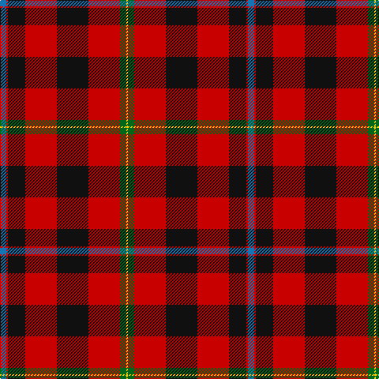

The parent of this is [Templeton (Name?)](/tartans/b/8/r2/k22/r40/k40/r40/g8/y/2/)

This was sourced from tartans-authority.  It is a [8 stripes tartan](/stripes/stripes8/).

Original link http://www.tartansauthority.com/tartan-ferret/display/8512/

## Thread count
B/8 R2 K22 R40 K40 R40 G8 Y/2

## Palette
Each colour and its ΔE from the base-6 reference it is a variant of.

| Colour | Shade | Base | ΔE (OKLab) |
|---|---|---|---|
| B |  `#1474B4` | B  | 0.15 |
| G |  `#006818` | G  | 0.02 |
| K |  `#101010` | K  | 0.17 |
| R |  `#C80000` | R  | 0.00 |
| Y |  `#FCCC00` | Y  | 0.04 |

# Sample pattern

ID: /variants/b/8/r2/k22/r40/k40/r40/g8/y/2-b1474b4-g006818-k101010-rc80000-yfccc00/
