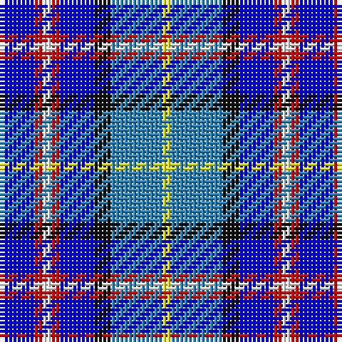

The parent of this is [Lopatinsky](/tartans/b/8/r2/w2/r2/b8/k4/ba12/y/2/)

This was sourced from register-of-tartans.  It is a [8 stripes tartan](/stripes/stripes8/).

Original link https://www.tartanregister.gov.uk/tartanDetails.aspx?ref=5745

## Thread count
B/8 R2 W2 R2 B8 K4 Ba12 Y/2

## Palette
Each colour and its ΔE from the base-6 reference it is a variant of.

| Colour | Shade | Base | ΔE (OKLab) |
|---|---|---|---|
| B |  `#0000FF` | B  | 0.21 |
| Ba |  `#2888C4` | B  | 0.21 |
| K |  `#101010` | K  | 0.17 |
| R |  `#DC0000` | R  | 0.04 |
| W |  `#FFFFFF` | W  | 0.03 |
| Y |  `#FFFF00` | Y  | 0.16 |

# Sample pattern

ID: /variants/b/8/r2/w2/r2/b8/k4/ba12/y/2-b0000ff-ba2888c4-k101010-rdc0000-wffffff-yffff00/
