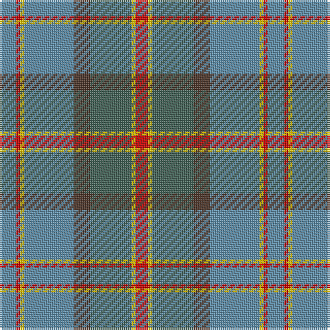

The parent of this is [Hawaii (District)](/tartans/b/8/r2/y2/b24/t8/n20/y2/r/6/)

This was sourced from tartans-authority.  It is a [8 stripes tartan](/stripes/stripes8/).

Original link http://www.tartansauthority.com/tartan-ferret/display/5163/

## Thread count
B/8 R2 Y2 B24 T8 N20 Y2 R/6

## Palette
Each colour and its ΔE from the base-6 reference it is a variant of.

| Colour | Shade | Base | ΔE (OKLab) |
|---|---|---|---|
| B |  `#5C8CA8` | B  | 0.23 |
| N |  `#406054` | G  | 0.11 |
| R |  `#C80000` | R  | 0.00 |
| T |  `#4C3428` | B  | 0.16 |
| Y |  `#E8C000` | Y  | 0.00 |

# Sample pattern

ID: /variants/b/8/r2/y2/b24/t8/n20/y2/r/6-b5c8ca8-n406054-rc80000-t4c3428-ye8c000/
