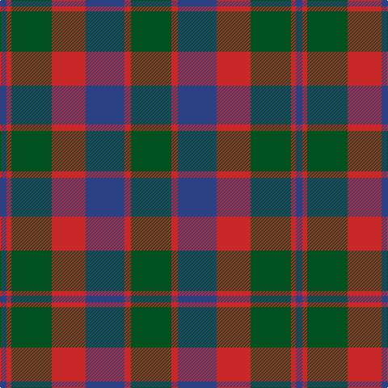

The parent of this is [Glasgow #2](/tartans/b/8/r6/g50/r42/b48/r8/g/50/)

This was sourced from register-of-tartans.  It is a [7 stripes tartan](/stripes/stripes7/).

Original link https://www.tartanregister.gov.uk/tartanDetails.aspx?ref=1349

## Thread count
B/8 R6 G50 R42 B48 R8 G/50

## Palette
Each colour and its ΔE from the base-6 reference it is a variant of.

| Colour | Shade | Base | ΔE (OKLab) |
|---|---|---|---|
| B |  `#2C4084` | B  | 0.00 |
| G |  `#005020` | G  | 0.08 |
| R |  `#C82828` | R  | 0.03 |

# Sample pattern

ID: /variants/b/8/r6/g50/r42/b48/r8/g/50-b2c4084-g005020-rc82828/
