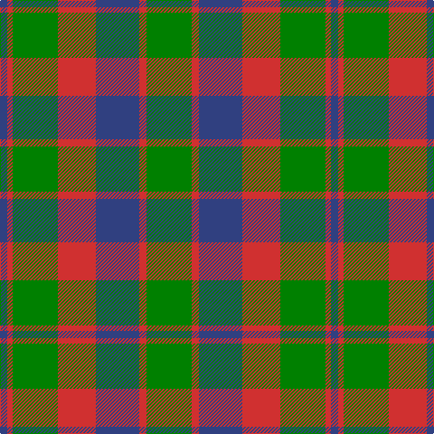

The parent of this is [Glasgow](/tartans/b/8/r6/g50/r42/b48/r8/g/50/)

This was sourced from weddslist.  It is a [7 stripes tartan](/stripes/stripes7/).

Original link http://www.weddslist.com/cgi-bin/tartans/pg.pl?source=sts

## Thread count
B/8 R6 G50 R42 B48 R8 G/50

## Palette
Each colour and its ΔE from the base-6 reference it is a variant of.

| Colour | Shade | Base | ΔE (OKLab) |
|---|---|---|---|
| B |  `#304080` | B  | 0.01 |
| G |  `#008000` | G  | 0.09 |
| R |  `#D03030` | R  | 0.05 |

# Sample pattern

ID: /variants/b/8/r6/g50/r42/b48/r8/g/50-b304080-g008000-rd03030/
