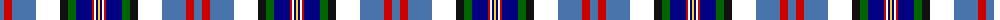

The parent of this is [Arisaig NS Canada](/tartans/b/8/r8/b24/w24/k8/g8/db16/r2/w2/db2/y/2/)

This was sourced from register-of-tartans.  It is a [11 stripes tartan](/stripes/stripes11/).

Original link https://www.tartanregister.gov.uk/tartanDetails.aspx?ref=10170

## Thread count
B/8 R8 B24 W24 K8 G8 DB16 R2 W2 DB2 Y/2

## Palette
Each colour and its ΔE from the base-6 reference it is a variant of.

| Colour | Shade | Base | ΔE (OKLab) |
|---|---|---|---|
| B |  `#4973AB` | B  | 0.16 |
| DB |  `#000080` | B  | 0.14 |
| G |  `#006400` | G  | 0.00 |
| K |  `#101010` | K  | 0.17 |
| R |  `#CD0000` | R  | 0.01 |
| W |  `#FFFFFF` | W  | 0.03 |
| Y |  `#FCD116` | Y  | 0.05 |

ID: /variants/b/8/r8/b24/w24/k8/g8/db16/r2/w2/db2/y/2-b4973ab-db000080-g006400-k101010-rcd0000-wffffff-yfcd116/
