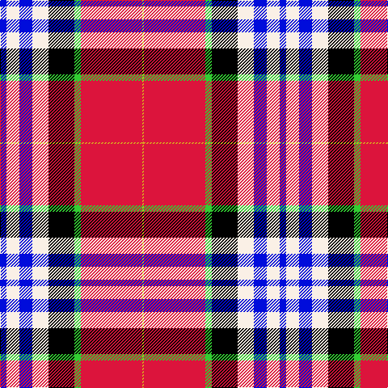

The parent of this is [Edinburgh Napier University](/tartans/b/8/w16/b16/w20/k32/g8/r76/y/2/)

This was sourced from register-of-tartans.  It is a [8 stripes tartan](/stripes/stripes8/).

Original link https://www.tartanregister.gov.uk/tartanDetails.aspx?ref=10005

## Thread count
B/8 W16 B16 W20 K32 G8 R76 Y/2

## Palette
Each colour and its ΔE from the base-6 reference it is a variant of.

| Colour | Shade | Base | ΔE (OKLab) |
|---|---|---|---|
| B |  `#000CDB` | B  | 0.16 |
| G |  `#32CD32` | Y  | 0.19 |
| K |  `#000000` | K  | 0.00 |
| R |  `#DC143C` | R  | 0.06 |
| W |  `#FAF0E6` | W  | 0.01 |
| Y |  `#DAA520` | Y  | 0.08 |

# Sample pattern

ID: /variants/b/8/w16/b16/w20/k32/g8/r76/y/2-b000cdb-g32cd32-k000000-rdc143c-wfaf0e6-ydaa520/
