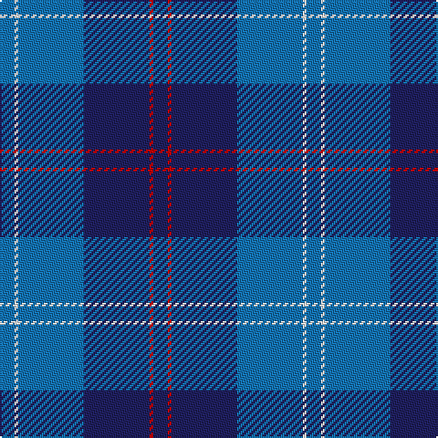

The parent of this is [Ewell Castle School](/tartans/b/8/w2/b36/db36/r2/db/8/)

This was sourced from tartans-authority.  It is a [6 stripes tartan](/stripes/stripes6/).

Original link http://www.tartansauthority.com/tartan-ferret/display/11288/

## Thread count
B/8 W2 B36 DB36 R2 DB/8

## Palette
Each colour and its ΔE from the base-6 reference it is a variant of.

| Colour | Shade | Base | ΔE (OKLab) |
|---|---|---|---|
| B |  `#1474B4` | B  | 0.15 |
| DB |  `#202060` | B  | 0.11 |
| R |  `#C80000` | R  | 0.00 |
| W |  `#FCFCFC` | W  | 0.03 |

# Sample pattern

ID: /variants/b/8/w2/b36/db36/r2/db/8-b1474b4-db202060-rc80000-wfcfcfc/
