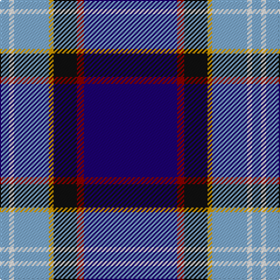

The parent of this is [U.S. Forces Thurso (Military)](/tartans/b/8/w4/b30/dy4/k20/dr6/db/80/)

This was sourced from tartans-authority.  It is a [7 stripes tartan](/stripes/stripes7/).

Original link http://www.tartansauthority.com/tartan-ferret/display/5074/

## Thread count
B/8 W4 B30 DY4 K20 DR6 DB/80

## Palette
Each colour and its ΔE from the base-6 reference it is a variant of.

| Colour | Shade | Base | ΔE (OKLab) |
|---|---|---|---|
| B |  `#7CA8CC` | Y  | 0.25 |
| DB |  `#1C0070` | B  | 0.14 |
| DR |  `#880000` | R  | 0.14 |
| DY |  `#D09800` | Y  | 0.11 |
| K |  `#101010` | K  | 0.17 |
| W |  `#FCFCFC` | W  | 0.03 |

# Sample pattern

ID: /variants/b/8/w4/b30/dy4/k20/dr6/db/80-b7ca8cc-db1c0070-dr880000-dyd09800-k101010-wfcfcfc/
