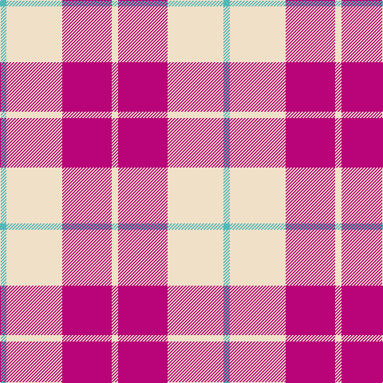

The parent of this is [Lewis, Magenta (Dance)](/tartans/b/8/w70/r62/w/8/)

This was sourced from tartans-authority.  It is a [4 stripes tartan](/stripes/stripes4/).

Original link http://www.tartansauthority.com/tartan-ferret/display/7579/

## Thread count
B/8 W70 R62 W/8

## Palette
Each colour and its ΔE from the base-6 reference it is a variant of.

| Colour | Shade | Base | ΔE (OKLab) |
|---|---|---|---|
| B |  `#54B8B8` | Y  | 0.23 |
| R |  `#B80478` | R  | 0.14 |
| W |  `#F0E0C8` | W  | 0.06 |

# Sample pattern

ID: /variants/b/8/w70/r62/w/8-b54b8b8-rb80478-wf0e0c8/
