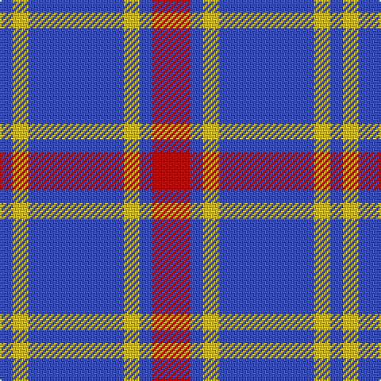

The parent of this is [UEFA (Glasgow)](/tartans/b/8/y10/b60/y10/b8/r/24/)

This was sourced from register-of-tartans.  It is a [6 stripes tartan](/stripes/stripes6/).

Original link https://www.tartanregister.gov.uk/tartanDetails.aspx?ref=4194

## Thread count
B/8 Y10 B60 Y10 B8 R/24

## Palette
Each colour and its ΔE from the base-6 reference it is a variant of.

| Colour | Shade | Base | ΔE (OKLab) |
|---|---|---|---|
| B |  `#3850C8` | B  | 0.12 |
| R |  `#C80000` | R  | 0.00 |
| Y |  `#E8C000` | Y  | 0.00 |

# Sample pattern

ID: /variants/b/8/y10/b60/y10/b8/r/24-b3850c8-rc80000-ye8c000/
