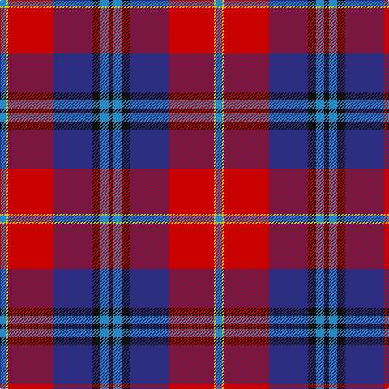

The parent of this is [McKnight (Personal)](/tartans/b/8/y2/r56/db48/k10/b10/k/6/)

This was sourced from tartans-authority.  It is a [7 stripes tartan](/stripes/stripes7/).

Original link http://www.tartansauthority.com/tartan-ferret/display/6213/

## Thread count
B/8 Y2 R56 DB48 K10 B10 K/6

## Palette
Each colour and its ΔE from the base-6 reference it is a variant of.

| Colour | Shade | Base | ΔE (OKLab) |
|---|---|---|---|
| B |  `#2888C4` | B  | 0.21 |
| DB |  `#2C2C80` | B  | 0.05 |
| K |  `#101010` | K  | 0.17 |
| R |  `#C80000` | R  | 0.00 |
| Y |  `#E8C000` | Y  | 0.00 |

# Sample pattern

ID: /variants/b/8/y2/r56/db48/k10/b10/k/6-b2888c4-db2c2c80-k101010-rc80000-ye8c000/
