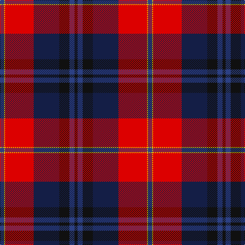

The parent of this is [McKnight Dress (Personal)](/tartans/b/8/y2/r56/db50/k20/b10/k/6/)

This was sourced from register-of-tartans.  It is a [7 stripes tartan](/stripes/stripes7/).

Original link https://www.tartanregister.gov.uk/tartanDetails.aspx?ref=2894

## Thread count
B/8 Y2 R56 DB50 K20 B10 K/6

## Palette
Each colour and its ΔE from the base-6 reference it is a variant of.

| Colour | Shade | Base | ΔE (OKLab) |
|---|---|---|---|
| B |  `#2C4084` | B  | 0.00 |
| DB |  `#141E46` | B  | 0.15 |
| K |  `#101010` | K  | 0.17 |
| R |  `#DC0000` | R  | 0.04 |
| Y |  `#E8C000` | Y  | 0.00 |

# Sample pattern

ID: /variants/b/8/y2/r56/db50/k20/b10/k/6-b2c4084-db141e46-k101010-rdc0000-ye8c000/
