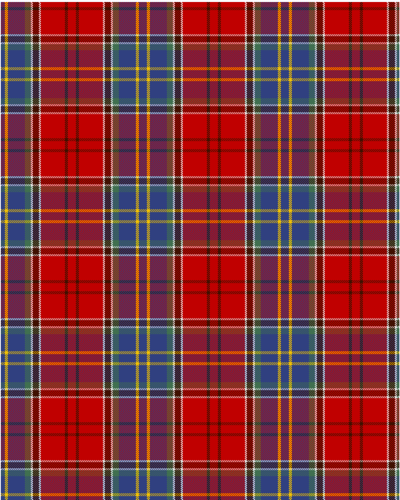

Asman Family

This was sourced from <no value>.  It is a 10 stripes tartan.

Original link http://www.weddslist.com/cgi-bin/tartans/pg.pl?source=sts

## Thread count
B/8 Y6 B34 G12 LN4 DR12 LN4 R48 DR6 R/8

## Palette
B#304080 DR#401000 G#407050 LN#E0E0E0 R#C00000 Y#F0C000

# Sample pattern

ID: /variants/b/8/y6/b34/g12/ln4/dr12/ln4/r48/dr6/r/8-b304080-dr401000-g407050-lne0e0e0-rc00000-yf0c000