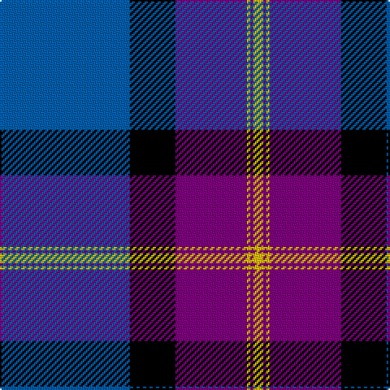

The parent of this is [British Energy](/tartans/b/80/k28/p44/y2/p2/y/6/)

This was sourced from weddslist.  It is a [6 stripes tartan](/stripes/stripes6/).

Original link http://www.weddslist.com/cgi-bin/tartans/pg.pl?source=sts

## Thread count
B/80 K28 P44 Y2 P2 Y/6

## Palette
Each colour and its ΔE from the base-6 reference it is a variant of.

| Colour | Shade | Base | ΔE (OKLab) |
|---|---|---|---|
| B |  `#0060B0` | B  | 0.11 |
| K |  `#000000` | K  | 0.00 |
| P |  `#800080` | B  | 0.17 |
| Y |  `#F0C000` | Y  | 0.01 |

# Sample pattern

ID: /variants/b/80/k28/p44/y2/p2/y/6-b0060b0-k000000-p800080-yf0c000/
