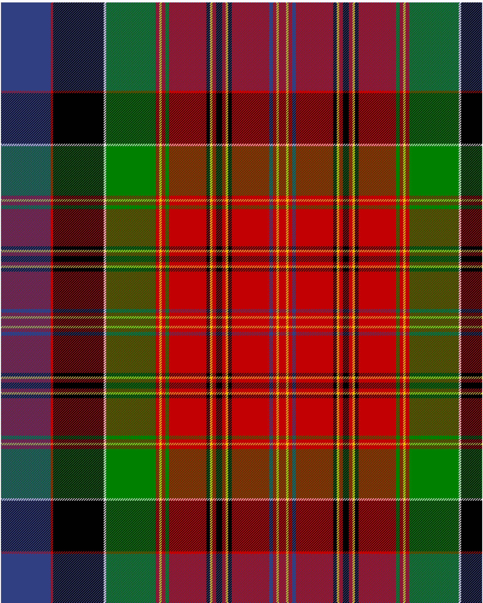

Hay, or Leith

This was sourced from <no value>.  It is a 22 stripes tartan.

Original link http://www.weddslist.com/cgi-bin/tartans/pg.pl?source=sts

## Thread count
B/82 R4 K84 LN4 G82 R6 Y4 R6 G6 R62 K6 Y4 R6 K10 R6 Y4 K6 R62 B6 R6 Y4 R/6

## Palette
B#304080 G#008000 K#000000 LN#E0E0E0 R#C00000 Y#F0C000

# Sample pattern

ID: /variants/b/82/r4/k84/ln4/g82/r6/y4/r6/g6/r62/k6/y4/r6/k10/r6/y4/k6/r62/b6/r6/y4/r/6-b304080-g008000-k000000-lne0e0e0-rc00000-yf0c000