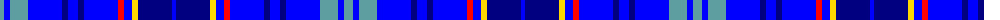

The parent of this is [Dempster (Personal)](/tartans/b/9/ba6/b18/ba34/db6/ba10/db6/ba34/r6/ba8/y6/db34/ba/4/)

This was sourced from register-of-tartans.  It is a [13 stripes tartan](/stripes/stripes13/).

Original link https://www.tartanregister.gov.uk/tartanDetails.aspx?ref=913

## Thread count
B/9 Ba6 B18 Ba34 DB6 Ba10 DB6 Ba34 R6 Ba8 Y6 DB34 Ba/4

## Palette
Each colour and its ΔE from the base-6 reference it is a variant of.

| Colour | Shade | Base | ΔE (OKLab) |
|---|---|---|---|
| B |  `#5E9EA0` | Y  | 0.25 |
| Ba |  `#0000FF` | B  | 0.21 |
| DB |  `#000080` | B  | 0.14 |
| R |  `#FF0000` | R  | 0.11 |
| Y |  `#FFD700` | Y  | 0.07 |

ID: /variants/b/9/ba6/b18/ba34/db6/ba10/db6/ba34/r6/ba8/y6/db34/ba/4-b5e9ea0-ba0000ff-db000080-rff0000-yffd700/
