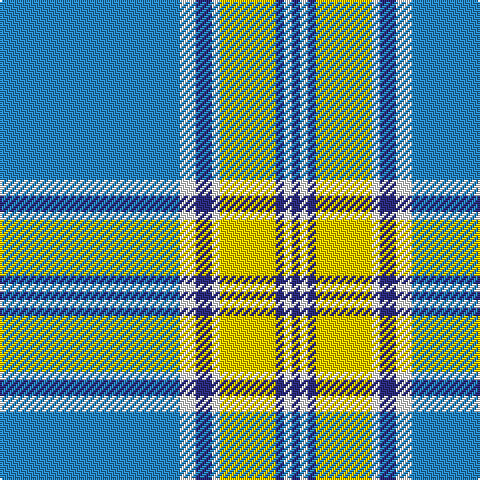

The parent of this is [Madras 1 (Fashion)](/tartans/b/90/w8/db8/w4/y28/db4/w4/db/4/)

This was sourced from tartans-authority.  It is a [8 stripes tartan](/stripes/stripes8/).

Original link http://www.tartansauthority.com/tartan-ferret/display/8600/

## Thread count
B/90 W8 DB8 W4 Y28 DB4 W4 DB/4

## Palette
Each colour and its ΔE from the base-6 reference it is a variant of.

| Colour | Shade | Base | ΔE (OKLab) |
|---|---|---|---|
| B |  `#2888C4` | B  | 0.21 |
| DB |  `#2C2C80` | B  | 0.05 |
| W |  `#FCFCFC` | W  | 0.03 |
| Y |  `#FCCC00` | Y  | 0.04 |

# Sample pattern

ID: /variants/b/90/w8/db8/w4/y28/db4/w4/db/4-b2888c4-db2c2c80-wfcfcfc-yfccc00/
