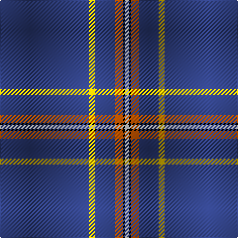

The parent of this is [Wylie](/tartans/b/90/y6/b20/o8/k2/ln/4/)

This was sourced from weddslist.  It is a [6 stripes tartan](/stripes/stripes6/).

Original link http://www.weddslist.com/cgi-bin/tartans/pg.pl?source=sts

## Thread count
B/90 Y6 B20 O8 K2 LN/4

## Palette
Each colour and its ΔE from the base-6 reference it is a variant of.

| Colour | Shade | Base | ΔE (OKLab) |
|---|---|---|---|
| B |  `#304080` | B  | 0.01 |
| K |  `#000000` | K  | 0.00 |
| LN |  `#E0E0E0` | W  | 0.06 |
| O |  `#E06000` | R  | 0.14 |
| Y |  `#F0C000` | Y  | 0.01 |

# Sample pattern

ID: /variants/b/90/y6/b20/o8/k2/ln/4-b304080-k000000-lne0e0e0-oe06000-yf0c000/
