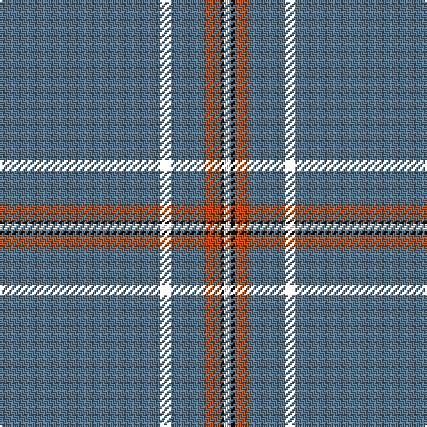

The parent of this is [Wylie](/tartans/b/90/yy6/b20/do8/k2/w/4/)

This was sourced from register-of-tartans.  It is a [6 stripes tartan](/stripes/stripes6/).

Original link https://www.tartanregister.gov.uk/tartanDetails.aspx?ref=4788

## Thread count
B/90 YY6 B20 DO8 K2 W/4

## Palette
Each colour and its ΔE from the base-6 reference it is a variant of.

| Colour | Shade | Base | ΔE (OKLab) |
|---|---|---|---|
| B |  `#587488` | B  | 0.17 |
| DO |  `#C04C08` | R  | 0.08 |
| K |  `#101010` | K  | 0.17 |
| W |  `#FCFCFC` | W  | 0.03 |

# Sample pattern

ID: /variants/b/90/yy6/b20/do8/k2/w/4-b587488-doc04c08-k101010-wfcfcfc/
