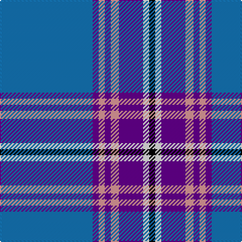

The parent of this is [Edinburgh Festival(Corporate)](/tartans/b/92/p6/lr6/p6/lr8/p24/w6/k/6/)

This was sourced from tartans-authority.  It is a [8 stripes tartan](/stripes/stripes8/).

Original link http://www.tartansauthority.com/tartan-ferret/display/4790/

## Thread count
B/92 P6 LR6 P6 LR8 P24 W6 K/6

## Palette
Each colour and its ΔE from the base-6 reference it is a variant of.

| Colour | Shade | Base | ΔE (OKLab) |
|---|---|---|---|
| B |  `#1474B4` | B  | 0.15 |
| K |  `#000000` | K  | 0.00 |
| LR |  `#EC9898` | Y  | 0.18 |
| P |  `#64008C` | B  | 0.13 |
| W |  `#FCFCFC` | W  | 0.03 |

# Sample pattern

ID: /variants/b/92/p6/lr6/p6/lr8/p24/w6/k/6-b1474b4-k000000-lrec9898-p64008c-wfcfcfc/
