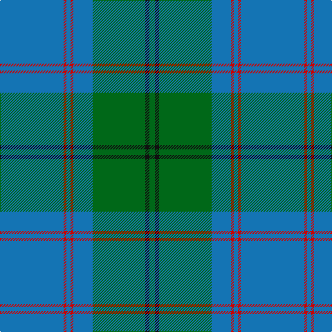

The parent of this is [Greenlaw, American (Name)](/tartans/b/92/r4/b6/r4/b28/g76/k6/g/8/)

This was sourced from tartans-authority.  It is a [8 stripes tartan](/stripes/stripes8/).

Original link http://www.tartansauthority.com/tartan-ferret/display/5791/

## Thread count
B/92 R4 B6 R4 B28 G76 K6 G/8

## Palette
Each colour and its ΔE from the base-6 reference it is a variant of.

| Colour | Shade | Base | ΔE (OKLab) |
|---|---|---|---|
| B |  `#1474B4` | B  | 0.15 |
| G |  `#006818` | G  | 0.02 |
| K |  `#101010` | K  | 0.17 |
| R |  `#C80000` | R  | 0.00 |

# Sample pattern

ID: /variants/b/92/r4/b6/r4/b28/g76/k6/g/8-b1474b4-g006818-k101010-rc80000/
