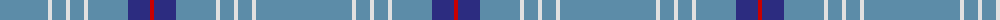

The parent of this is [RAAF #3](/tartans/b/96/ln4/b14/ln4/b14/ln4/b40/db22/r/4/)

This was sourced from register-of-tartans.  It is a [9 stripes tartan](/stripes/stripes9/).

Original link https://www.tartanregister.gov.uk/tartanDetails.aspx?ref=5342

## Thread count
B/96 LN4 B14 LN4 B14 LN4 B40 DB22 R/4

## Palette
Each colour and its ΔE from the base-6 reference it is a variant of.

| Colour | Shade | Base | ΔE (OKLab) |
|---|---|---|---|
| B |  `#5C8CA8` | B  | 0.23 |
| DB |  `#2C2C80` | B  | 0.05 |
| LN |  `#E0E0E0` | W  | 0.06 |
| R |  `#C80000` | R  | 0.00 |

ID: /variants/b/96/ln4/b14/ln4/b14/ln4/b40/db22/r/4-b5c8ca8-db2c2c80-lne0e0e0-rc80000/
