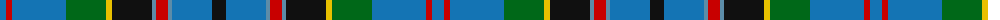

The parent of this is [Stinson (Name)](/tartans/ba/12/r6/ba54/g40/y6/k40/b4/r12/b4/ba40/k/14/)

This was sourced from tartans-authority.  It is a [11 stripes tartan](/stripes/stripes11/).

Original link http://www.tartansauthority.com/tartan-ferret/display/438/

## Thread count
Ba/12 R6 Ba54 G40 Y6 K40 B4 R12 B4 Ba40 K/14

## Palette
Each colour and its ΔE from the base-6 reference it is a variant of.

| Colour | Shade | Base | ΔE (OKLab) |
|---|---|---|---|
| B |  `#5C8CA8` | B  | 0.23 |
| Ba |  `#1474B4` | B  | 0.15 |
| G |  `#006818` | G  | 0.02 |
| K |  `#101010` | K  | 0.17 |
| R |  `#C80000` | R  | 0.00 |
| Y |  `#E8C000` | Y  | 0.00 |

ID: /variants/ba/12/r6/ba54/g40/y6/k40/b4/r12/b4/ba40/k/14-b5c8ca8-ba1474b4-g006818-k101010-rc80000-ye8c000/
