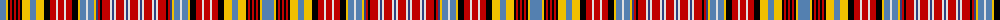

The parent of this is [Ogilvie 3](/tartans/ba/12/y2/k2/r2/k2/r2/k2/r2/k2/y8/ba6/y8/k6/r6/ln2/r6/ln2/r6/k6/y2/ba6/ln2/ba6/y2/b2/r2/k2/r8/ln2/b2/ln2/r8/ln2/b2/ln2/r/8/)

This was sourced from weddslist.  It is a [36 stripes tartan](/stripes/stripes36/).

Original link http://www.weddslist.com/cgi-bin/tartans/pg.pl?source=sts

## Thread count
Ba/12 Y2 K2 R2 K2 R2 K2 R2 K2 Y8 Ba6 Y8 K6 R6 LN2 R6 LN2 R6 K6 Y2 Ba6 LN2 Ba6 Y2 B2 R2 K2 R8 LN2 B2 LN2 R8 LN2 B2 LN2 R/8

## Palette
Each colour and its ΔE from the base-6 reference it is a variant of.

| Colour | Shade | Base | ΔE (OKLab) |
|---|---|---|---|
| B |  `#304080` | B  | 0.01 |
| Ba |  `#5480B0` | B  | 0.20 |
| K |  `#000000` | K  | 0.00 |
| LN |  `#E0E0E0` | W  | 0.06 |
| R |  `#C00000` | R  | 0.02 |
| Y |  `#F0C000` | Y  | 0.01 |

ID: /variants/ba/12/y2/k2/r2/k2/r2/k2/r2/k2/y8/ba6/y8/k6/r6/ln2/r6/ln2/r6/k6/y2/ba6/ln2/ba6/y2/b2/r2/k2/r8/ln2/b2/ln2/r8/ln2/b2/ln2/r/8-b304080-ba5480b0-k000000-lne0e0e0-rc00000-yf0c000/
