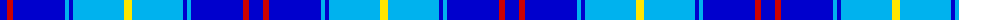

The parent of this is [International Police Association (IPA 2010)](/tartans/ba/14/r6/ba52/b4/ba4/b51/y/8/)

This was sourced from register-of-tartans.  It is a [7 stripes tartan](/stripes/stripes7/).

Original link https://www.tartanregister.gov.uk/tartanDetails.aspx?ref=10174

## Thread count
Ba/14 R6 Ba52 B4 Ba4 B51 Y/8

## Palette
Each colour and its ΔE from the base-6 reference it is a variant of.

| Colour | Shade | Base | ΔE (OKLab) |
|---|---|---|---|
| B |  `#00B2EE` | W  | 0.29 |
| Ba |  `#0000CD` | B  | 0.15 |
| R |  `#CD0000` | R  | 0.01 |
| Y |  `#FFE600` | Y  | 0.10 |

# Sample pattern

ID: /variants/ba/14/r6/ba52/b4/ba4/b51/y/8-b00b2ee-ba0000cd-rcd0000-yffe600/
