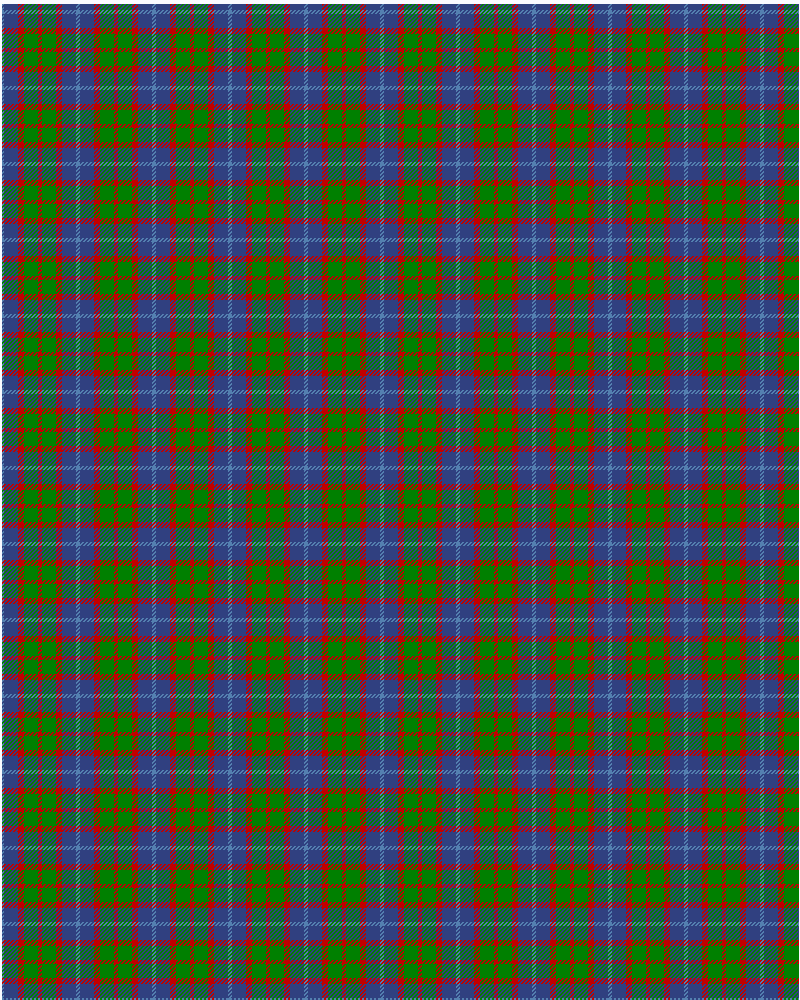

Hebridean 4

This was sourced from <no value>.  It is a 5 stripes tartan.

Original link http://www.weddslist.com/cgi-bin/tartans/pg.pl?source=sts

## Thread count
BA/2 B14 R6 G14 R/2

## Palette
B#304080 BA#5480B0 G#008000 R#C00000

# Sample pattern

ID: /variants/ba/2/b14/r6/g14/r/2-b304080-ba5480b0-g008000-rc00000