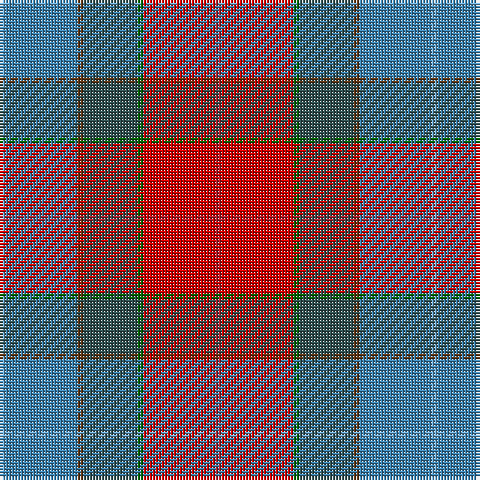

The parent of this is [Wallace Memorial Centenary](/tartans/ba/2/b24/t2/n18/g2/ra24/r/2/)

This was sourced from register-of-tartans.  It is a [7 stripes tartan](/stripes/stripes7/).

Original link https://www.tartanregister.gov.uk/tartanDetails.aspx?ref=10680

## Thread count
Ba/2 B24 T2 N18 G2 Ra24 R/2

## Palette
Each colour and its ΔE from the base-6 reference it is a variant of.

| Colour | Shade | Base | ΔE (OKLab) |
|---|---|---|---|
| B |  `#3C82AF` | B  | 0.20 |
| Ba |  `#6CA6CD` | Y  | 0.27 |
| G |  `#006400` | G  | 0.00 |
| N |  `#2F4F4F` | B  | 0.11 |
| R |  `#AF1E2D` | R  | 0.05 |
| Ra |  `#CD0000` | R  | 0.01 |
| T |  `#603311` | G  | 0.18 |

# Sample pattern

ID: /variants/ba/2/b24/t2/n18/g2/ra24/r/2-b3c82af-ba6ca6cd-g006400-n2f4f4f-raf1e2d-racd0000-t603311/
