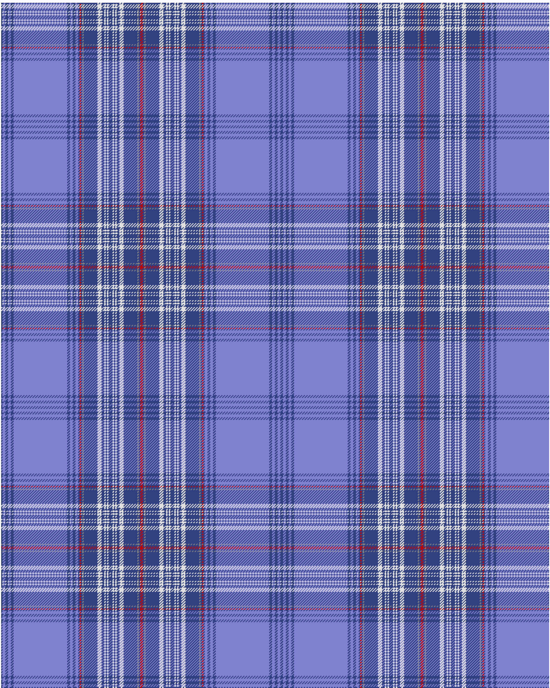

Edinburgh, '86 Border

This was sourced from <no value>.  It is a 30 stripes tartan.

Original link http://www.weddslist.com/cgi-bin/tartans/pg.pl?source=sts

## Thread count
BA/2 B4 BA4 B4 BA4 B78 BA4 B4 BA4 B4 BA2 R2 BA2 N2 BA20 LN6 BA4 LN2 BA2 LN2 BA6 LN2 BA2 LN2 BA4 LN6 BA20 N2 BA2 R/2

## Palette
B#8080D0 BA#304080 LN#E0E0E0 N#808080 R#C00000

# Sample pattern

ID: /variants/ba/2/b4/ba4/b4/ba4/b78/ba4/b4/ba4/b4/ba2/r2/ba2/n2/ba20/ln6/ba4/ln2/ba2/ln2/ba6/ln2/ba2/ln2/ba4/ln6/ba20/n2/ba2/r/2-b8080d0-ba304080-lne0e0e0-n808080-rc00000