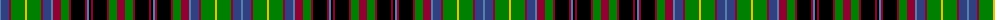

The parent of this is [Gordonstoun](/tartans/ba/2/b8/dr2/g14/y2/g14/dr2/b8/ba2/dr8/g8/dr2/k14/dr2/ba2/k2/dr2/k14/dr2/g8/dr/8/)

This was sourced from weddslist.  It is a [21 stripes tartan](/stripes/stripes21/).

Original link http://www.weddslist.com/cgi-bin/tartans/pg.pl?source=sts

## Thread count
Ba/2 B8 DR2 G14 Y2 G14 DR2 B8 Ba2 DR8 G8 DR2 K14 DR2 Ba2 K2 DR2 K14 DR2 G8 DR/8

## Palette
Each colour and its ΔE from the base-6 reference it is a variant of.

| Colour | Shade | Base | ΔE (OKLab) |
|---|---|---|---|
| B |  `#304080` | B  | 0.01 |
| Ba |  `#5480B0` | B  | 0.20 |
| DR |  `#900030` | R  | 0.13 |
| G |  `#008000` | G  | 0.09 |
| K |  `#000000` | K  | 0.00 |
| Y |  `#F0C000` | Y  | 0.01 |

ID: /variants/ba/2/b8/dr2/g14/y2/g14/dr2/b8/ba2/dr8/g8/dr2/k14/dr2/ba2/k2/dr2/k14/dr2/g8/dr/8-b304080-ba5480b0-dr900030-g008000-k000000-yf0c000/
