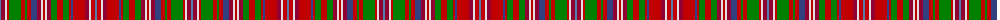

The parent of this is [MacDougall 8](/tartans/ba/2/dr4/ln2/r2/g12/r4/g2/r4/b6/dr4/ln2/r2/ln2/dr4/g6/r6/g6/r2/b2/r12/dr4/ln2/r4/ba/2/)

This was sourced from weddslist.  It is a [24 stripes tartan](/stripes/stripes24/).

Original link http://www.weddslist.com/cgi-bin/tartans/pg.pl?source=sts

## Thread count
Ba/2 DR4 LN2 R2 G12 R4 G2 R4 B6 DR4 LN2 R2 LN2 DR4 G6 R6 G6 R2 B2 R12 DR4 LN2 R4 Ba/2

## Palette
Each colour and its ΔE from the base-6 reference it is a variant of.

| Colour | Shade | Base | ΔE (OKLab) |
|---|---|---|---|
| B |  `#304080` | B  | 0.01 |
| Ba |  `#5480B0` | B  | 0.20 |
| DR |  `#900030` | R  | 0.13 |
| G |  `#008000` | G  | 0.09 |
| LN |  `#E0E0E0` | W  | 0.06 |
| R |  `#C00000` | R  | 0.02 |

ID: /variants/ba/2/dr4/ln2/r2/g12/r4/g2/r4/b6/dr4/ln2/r2/ln2/dr4/g6/r6/g6/r2/b2/r12/dr4/ln2/r4/ba/2-b304080-ba5480b0-dr900030-g008000-lne0e0e0-rc00000/
