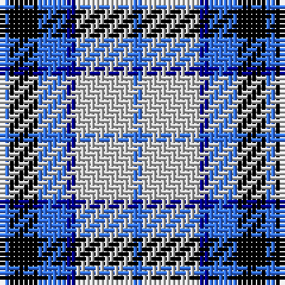

The parent of this is [Thompson (Dance)](/tartans/ba/2/k6/ba6/db2/n12/ba/2/)

This was sourced from register-of-tartans.  It is a [6 stripes tartan](/stripes/stripes6/).

Original link https://www.tartanregister.gov.uk/tartanDetails.aspx?ref=4108

## Thread count
Ba/2 K6 Ba6 DB2 N12 Ba/2

## Palette
Each colour and its ΔE from the base-6 reference it is a variant of.

| Colour | Shade | Base | ΔE (OKLab) |
|---|---|---|---|
| B |  `#3474FC` | B  | 0.23 |
| Ba |  `#3474FC` | B  | 0.23 |
| DB |  `#00008C` | B  | 0.13 |
| K |  `#000000` | K  | 0.00 |
| N |  `#C8C8C8` | W  | 0.13 |

# Sample pattern

ID: /variants/ba/2/k6/ba6/db2/n12/ba/2-b3474fc-ba3474fc-db00008c-k000000-nc8c8c8/
