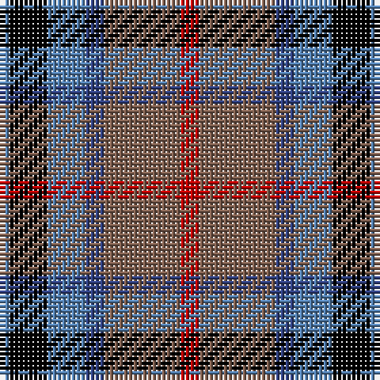

The parent of this is [Thom(p)son's, Fancy](/tartans/ba/2/k8/ba8/b4/lt16/r/4/)

This was sourced from weddslist.  It is a [6 stripes tartan](/stripes/stripes6/).

Original link http://www.weddslist.com/cgi-bin/tartans/pg.pl?source=sts

## Thread count
Ba/2 K8 Ba8 B4 LT16 R/4

## Palette
Each colour and its ΔE from the base-6 reference it is a variant of.

| Colour | Shade | Base | ΔE (OKLab) |
|---|---|---|---|
| B |  `#304080` | B  | 0.01 |
| Ba |  `#5480B0` | B  | 0.20 |
| K |  `#000000` | K  | 0.00 |
| LT |  `#806050` | R  | 0.17 |
| R |  `#C00000` | R  | 0.02 |

# Sample pattern

ID: /variants/ba/2/k8/ba8/b4/lt16/r/4-b304080-ba5480b0-k000000-lt806050-rc00000/
