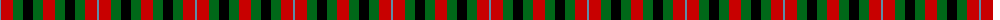
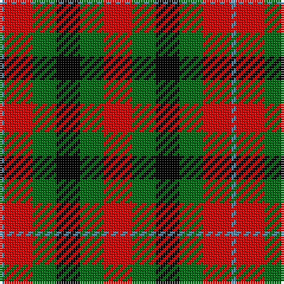

The parent of this is [Norwich No.028](/tartans/ba/2/r12/g10/k10/g10/r/12/)

This was sourced from register-of-tartans.  It is a [6 stripes tartan](/stripes/stripes6/).

Original link https://www.tartanregister.gov.uk/tartanDetails.aspx?ref=3177

## Thread count
Ba/2 R12 G10 K10 G10 R/12

## Palette
Each colour and its ΔE from the base-6 reference it is a variant of.

| Colour | Shade | Base | ΔE (OKLab) |
|---|---|---|---|
| B |  `#2888C4` | B  | 0.21 |
| Ba |  `#5C8CA8` | B  | 0.23 |
| DG |  `#004028` | G  | 0.14 |
| G |  `#006818` | G  | 0.02 |
| K |  `#000000` | K  | 0.00 |
| LB |  `#00FCFC` | W  | 0.17 |
| R |  `#C80000` | R  | 0.00 |

# Sample pattern

ID: /variants/ba/2/r12/g10/k10/g10/r/12-b2888c4-ba5c8ca8-dg004028-g006818-k000000-lb00fcfc-rc80000/
