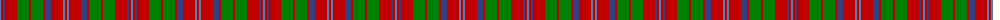

The parent of this is [MacQuarrie 4](/tartans/ba/2/r2/b2/r12/g12/r2/g12/r2/b6/r12/ba2/r/2/)

This was sourced from weddslist.  It is a [12 stripes tartan](/stripes/stripes12/).

Original link http://www.weddslist.com/cgi-bin/tartans/pg.pl?source=sts

## Thread count
Ba/2 R2 B2 R12 G12 R2 G12 R2 B6 R12 Ba2 R/2

## Palette
Each colour and its ΔE from the base-6 reference it is a variant of.

| Colour | Shade | Base | ΔE (OKLab) |
|---|---|---|---|
| B |  `#304080` | B  | 0.01 |
| Ba |  `#5480B0` | B  | 0.20 |
| G |  `#008000` | G  | 0.09 |
| R |  `#C00000` | R  | 0.02 |

ID: /variants/ba/2/r2/b2/r12/g12/r2/g12/r2/b6/r12/ba2/r/2-b304080-ba5480b0-g008000-rc00000/
