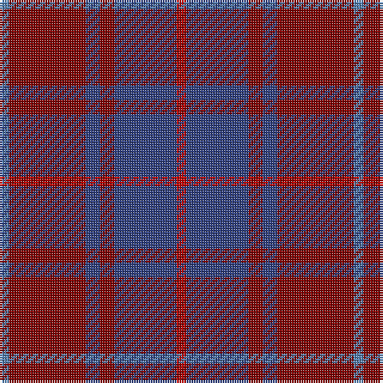

The parent of this is [MacArthur-Fox, dress](/tartans/ba/4/dr32/b6/dr6/b26/r/4/)

This was sourced from weddslist.  It is a [6 stripes tartan](/stripes/stripes6/).

Original link http://www.weddslist.com/cgi-bin/tartans/pg.pl?source=sts

## Thread count
Ba/4 DR32 B6 DR6 B26 R/4

## Palette
Each colour and its ΔE from the base-6 reference it is a variant of.

| Colour | Shade | Base | ΔE (OKLab) |
|---|---|---|---|
| B |  `#304080` | B  | 0.01 |
| Ba |  `#5480B0` | B  | 0.20 |
| DR |  `#800000` | R  | 0.16 |
| R |  `#C00000` | R  | 0.02 |

# Sample pattern

ID: /variants/ba/4/dr32/b6/dr6/b26/r/4-b304080-ba5480b0-dr800000-rc00000/
