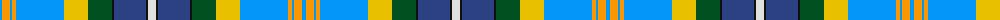

The parent of this is [Rwanda](/tartans/ba/4/dy8/ba2/dy4/ba48/y24/g24/k2/b32/k2/ln/8/)

This was sourced from register-of-tartans.  It is a [11 stripes tartan](/stripes/stripes11/).

Original link https://www.tartanregister.gov.uk/tartanDetails.aspx?ref=5947

## Thread count
Ba/4 DY8 Ba2 DY4 Ba48 Y24 G24 K2 B32 K2 LN/8

## Palette
Each colour and its ΔE from the base-6 reference it is a variant of.

| Colour | Shade | Base | ΔE (OKLab) |
|---|---|---|---|
| B |  `#2C4084` | B  | 0.00 |
| Ba |  `#0596FA` | B  | 0.28 |
| DY |  `#FA9600` | Y  | 0.10 |
| G |  `#005020` | G  | 0.08 |
| K |  `#101010` | K  | 0.17 |
| LN |  `#E0E0E0` | W  | 0.06 |
| Y |  `#E8C000` | Y  | 0.00 |

ID: /variants/ba/4/dy8/ba2/dy4/ba48/y24/g24/k2/b32/k2/ln/8-b2c4084-ba0596fa-dyfa9600-g005020-k101010-lne0e0e0-ye8c000/
